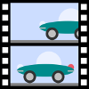

# Anime in Small Basic

This program is written in Microsoft Small Basic programming language.  Current version is just showing the form.

## Release
[Release](https://github.com/nonkit/Anime/releases) zip file contains following files.
- Anime.exe - Anime editor
- SmallBasicLibrary.dll - Small Basic Library
- LitDev.dll - LitDev Extension
- img - image files used in Anime editor

## Source

Following files are main source.  Subfolders contain output samples.

- Anime.sb - Anime v0.5a ([history](History.md))
- Normalize.sb - Shapes Normalize Sample v0.1
- Pilot.sb - Anime Pilot v0.2
- Rocket.sb - Rocket Sprite v0.1

## Credit

Made with Small Basic badge is designed by [rockycodeshimhe-1332](https://docs.microsoft.com/en-us/answers/questions/210063/guys-i-made-a-nice-small-basic-github-badge.html) 

## See Also

- [Wiki](http://github.com/nonkit/Anime/wiki) (documents)
- [Shapes](http://github.com/nonkit/Shapes) (sprite editor)

## Additional Resources

- [Small Basic](http://smallbasic.com)
- [LitDev Extension](http://litdev.co.uk/)
